# Self-Driving Car Computer Vision Projects

 

 

## Overview

- This repository is the result of following [this tutorial](https://www.youtube.com/watch?v=cPOtULagNnI) from Freecodecamp regarding how machine learning is applied in self-driving cars
- The purpose of following this tutorial was to strengthen my computer vision skills and to learn how they can be applied to an area that I am interested in, which is self-driving cars
- The content of this repository is split into seven sections; Road Segmentation with a Fully Convolutional Network, 2D Object Detection using YOLO, Object Tracking using Deep Sort, Homogenous Transforms using KITTI 3D Data Visualisation, Multi-Task Learning using a Multi Task Attention Network (MTAN), 3D Object Detection using SFA 3D, and Camera to Bird's Eye View using UNetXST
- The datasets used for these projects were not included in this repository due to their file size, but they can be found in the tutorial linked above via Kaggle

## Road Segmentation | Fully Convolutional Network

This project involves using [semantic segmentation](https://paperswithcode.com/task/semantic-segmentation) to identify the road that a self-driving car would be travelling on and distinguish it from the rest of its video input. In this project, this is facilitated by using a [Fully Convolutional Network](https://paperswithcode.com/method/fcn), which are a type of neural network architecture designed for semantic segmentation tasks, where the goal is to classify and assign a label to each pixel in an input image. Unlike traditional convolutional neural networks (CNNs) that output a fixed-size prediction, FCNs preserve spatial information by using transposed convolutions to upsample the feature maps, allowing them to generate dense pixel-wise predictions. The model used for this project was an adapted version of the [VGG16 model](https://datagen.tech/guides/computer-vision/vgg16/). Initially, the model was trained on image data, and then the trained model was tested on video input.

### Visual Output Examples

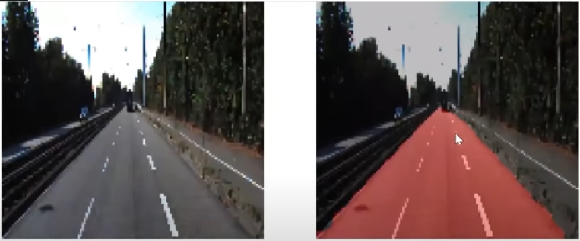
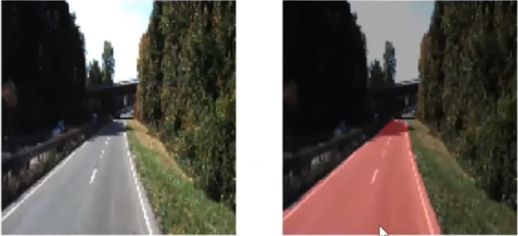
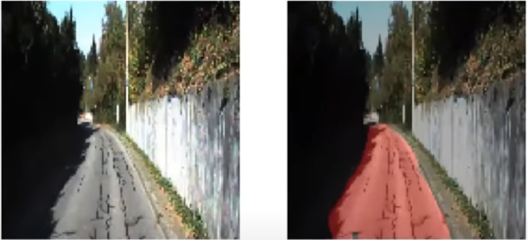

## 2D Object Detection | YOLO

This project involves [2D object detection](https://docs.viam.com/ml/vision/detection/) to identify cars and pedestrians that are present in video footage provided to a self-driving car. This is facilitated by using the [YOLOv3 model](https://viso.ai/deep-learning/yolov3-overview/), which stands for You Only Look Once, and is a popular object detection algorithm that efficiently detects and classifies objects within an image in real-time. It divides the input image into a grid and predicts bounding boxes and class probabilities for multiple objects simultaneously, streamlining the detection process. YOLOv3 incorporates a feature pyramid network and employs three different scales of detection to effectively handle objects of varying sizes, enhancing its performance across a wide range of scenarios. The model used in the project was based on the [Keras YOLOv3 architecture](https://github.com/experiencor/keras-yolo3), but was built using custom functions.

### Visual Output Examples

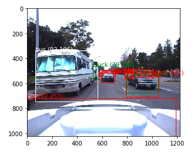
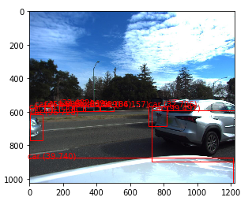
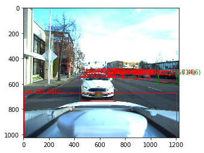
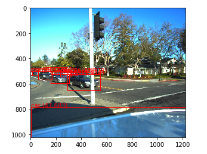

## Object Tracking | Deep SORT

This project involves using object tracking to identify distinct cars for the duration of a video input. This is facilitated by using [Deep SORT](https://arxiv.org/abs/1703.07402), or Deep Learning for Object Tracking, which is an extension of the SORT (Simple Online and Realtime Tracking) algorithm by integrating a deep appearance descriptor, often derived from a convolutional neural network (CNN). This combination enhances object tracking accuracy by incorporating deep learning features for more robust object identity representation. DeepSORT leverages a [Kalman filter](https://www.kalmanfilter.net/default.aspx#:~:text=The%20Kalman%20Filter%20is%20a%20widely%20used%20estimation%20algorithm%20that,measurements%20are%20imprecise%20and%20uncertain.) for state prediction and association, providing a probabilistic framework to estimate the state of the tracked objects over time. Additionally, it employs [Intersection over Union (IoU)](https://www.v7labs.com/blog/intersection-over-union-guide) metrics to refine bounding box associations, ensuring more accurate localization and identity assignment during tracking in complex scenarios with occlusions and crowded environments.

### Visual Output Examples

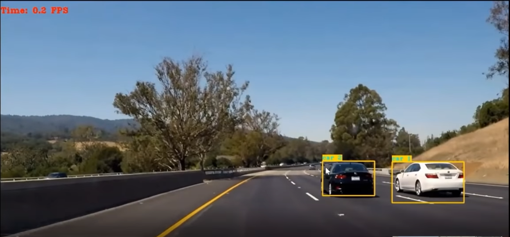
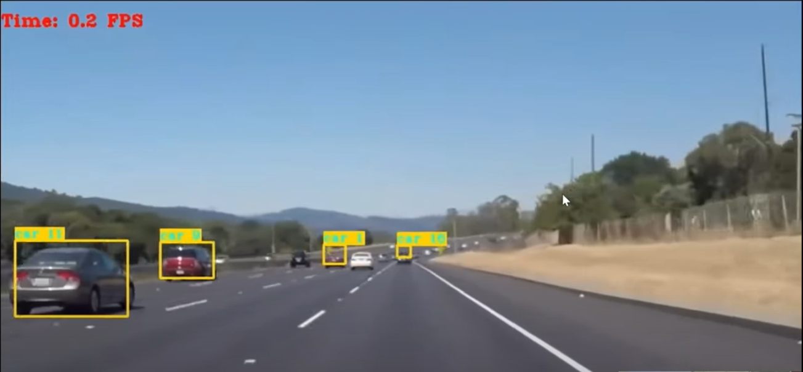

## Homogenous Transformations | KITTI 3D Data Visualisation

This project involves visualising data from the KITTI dataset, specifically traffic videos with cars. This is facilitated by using [Homogenous Transformations](https://mecharithm.com/learning/lesson/homogenous-transformation-matrices-configurations-in-robotics-12) based in [LIDAR](https://geoslam.com/what-is-lidar/) and camera data. Homogeneous transformations are employed to align the coordinate frames of LiDAR and camera sensors through calibration parameters such as translation and rotation matrices. Once aligned, these transformations facilitate the projection of 3D LiDAR points onto the 2D image plane, enabling the fusion of point cloud and image data. The resulting unified 3D representation, obtained through homogeneous transformation matrices, allows for comprehensive visualization and analysis in a common world coordinate system, enhancing applications like object detection and scene understanding.

### Visual Output Examples

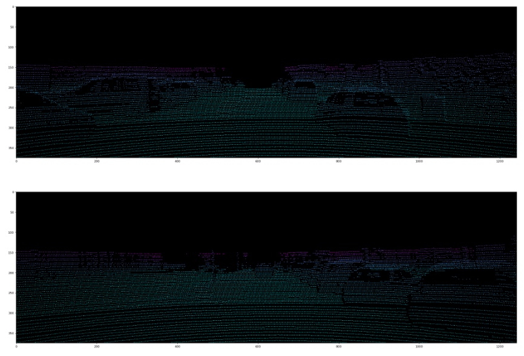
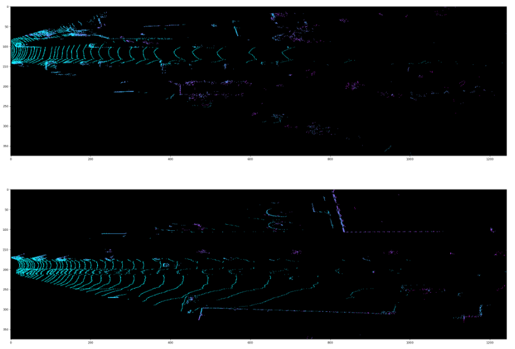
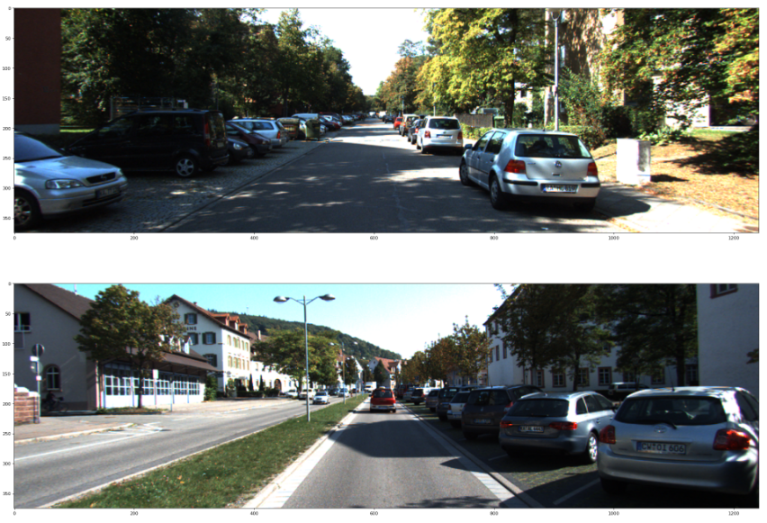
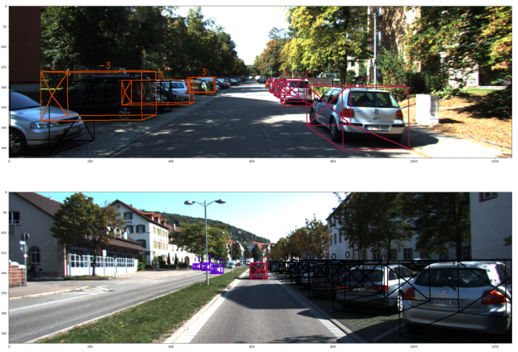
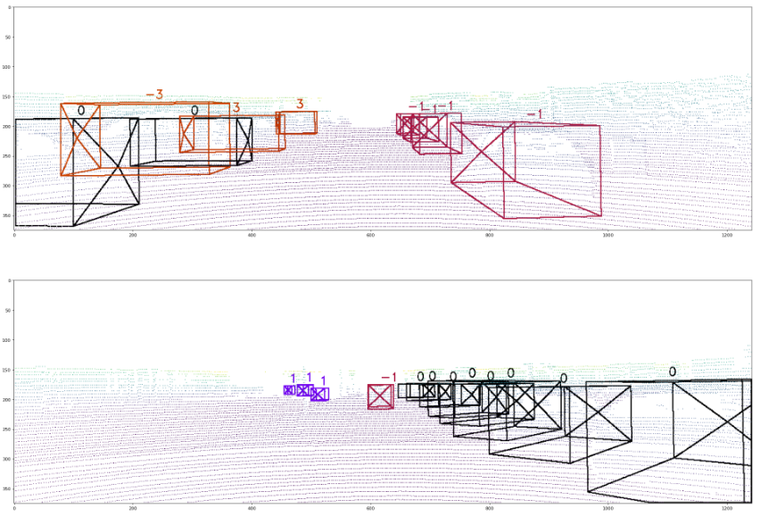

## Multi Task Learning | Multi Task Attention Network (MTAN)

This project involves visualising the depths of the relevant features of a image provided by the CityScapes dataset. This is facilitated by using a [Multi Task Attention Network](https://arxiv.org/abs/1803.10704) which is a neural network architectures designed for multitask learning scenarios. They utilize attention mechanisms to enable the model to selectively focus on different tasks during training. By incorporating task-specific attention modules, MTAN allows the network to learn shared representations across multiple tasks, enhancing overall performance by dynamically allocating attention based on the relevance of features to each task. In this scenario, object recognition, classification, and segmentation was required in order to visual the depth.

### Visual Output Examples

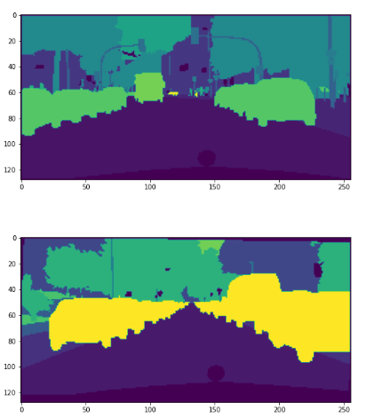
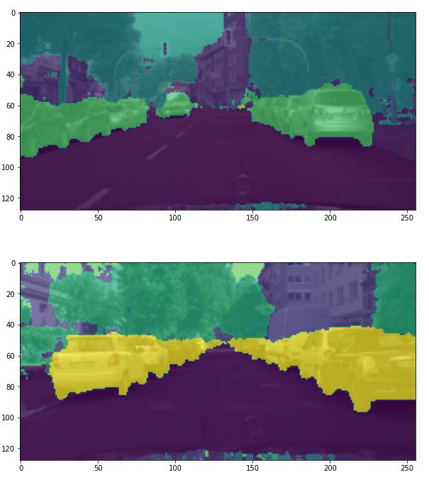
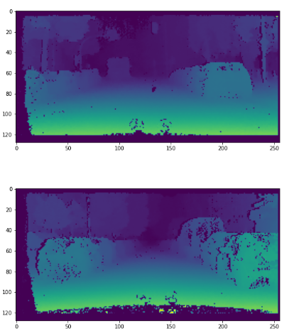
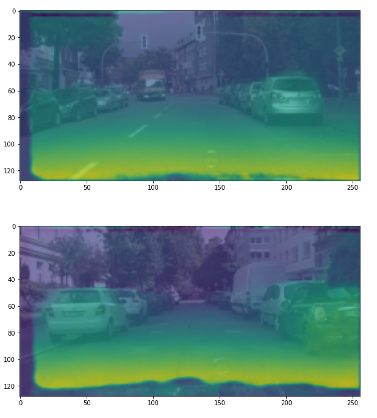

## 3D Object Detection | SFA 3D

## Camera to Bird's Eye View | UNetXST
